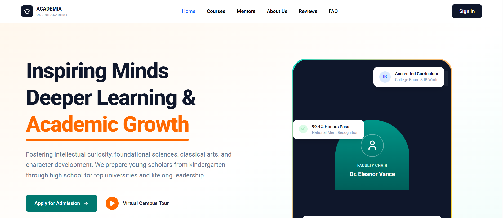
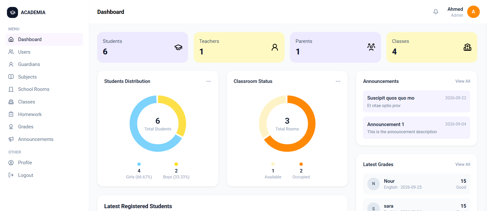
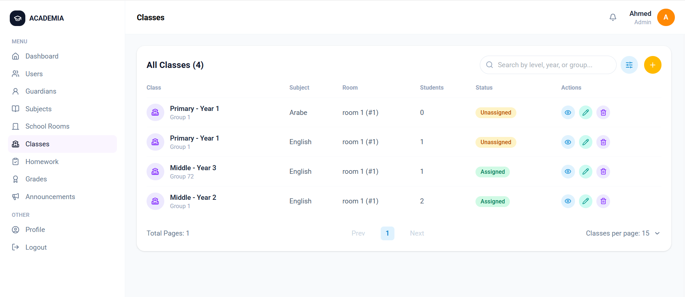
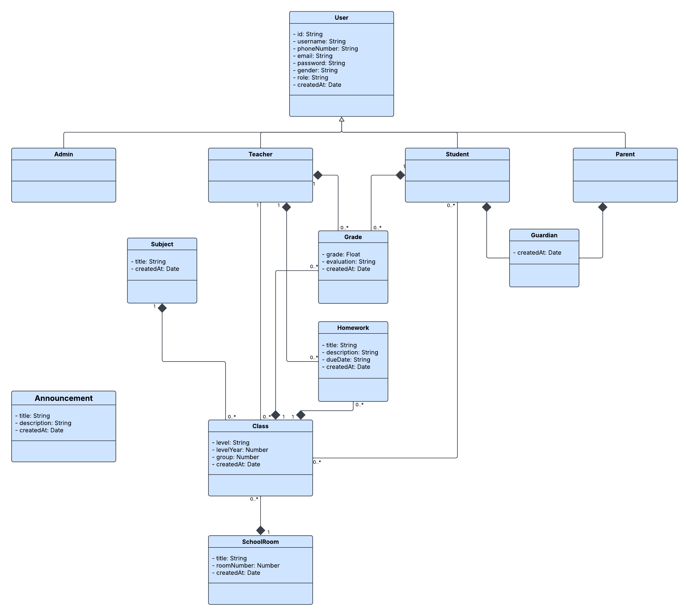
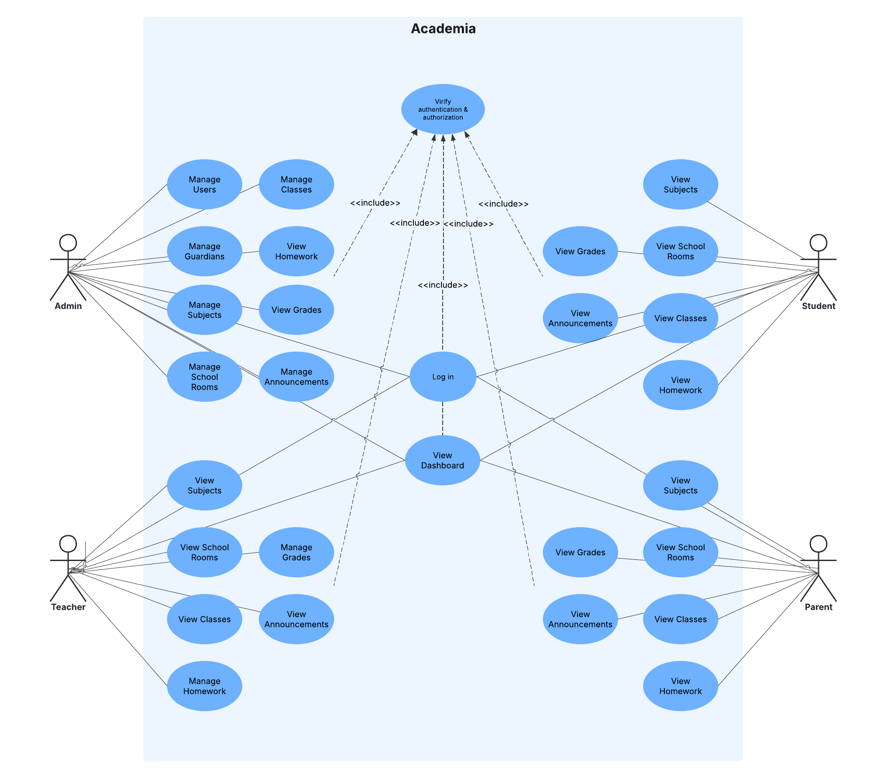
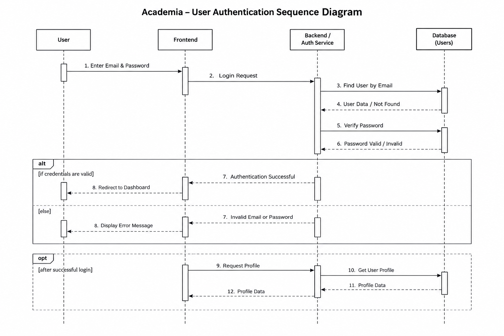

# 🎓 Academia

> **A modern, role-based school management platform for admins, teachers, parents, and students.**

<p align="center">
  
  
  
  
  
  
</p>

---

# 1. Project Name

**Project name:** Academia — School Management Platform

Academia is the current name of the application and is the project title used throughout this documentation.

---

# 2. Project Overview

Academia is a full-stack school management platform designed to centralize day-to-day academic and administrative operations in one application. It serves four main user roles: **Admin, Teacher, Parent, and Student**. The platform provides role-based dashboards, authentication, user management, classes, subjects, school rooms, grades, homework, announcements, guardian relationships, and detailed management pages. Its main goal is to make school information easier to manage, access, and share through a single modern interface.

### Who is it for?

-   🛡️ **Admins** — manage users, classes, rooms, subjects, guardians, announcements, grades, homework, and school-level information.
-   👨‍🏫 **Teachers** — work with classes, grades, homework, and teacher-specific dashboard data.
-   👨‍👩‍👧 **Parents** — access children-related information, academic data, homework, announcements, and parent-focused dashboard views.
-   🎓 **Students** — access classes, grades, homework, announcements, and student-focused dashboard views.

---

# 3. Problem Statement

Traditional school workflows often spread important information across separate tools, paper documents, spreadsheets, and informal communication channels. This makes it harder to keep user data consistent, follow academic activity, and give each school role the information it actually needs.

Academia addresses this problem by bringing authentication, role-based access, academic resources, user relationships, and school communication into one centralized application. The interface is organized around the user's role, while the backend applies the corresponding permissions to protected resources.

---

# 4. Main Features

The following features are currently implemented in the application:

-   🔐 **Authenticate users and enforce role-based access** for Admin, Teacher, Parent, and Student accounts.
-   👤 **Manage users** with registration, search, role filtering, pagination, user details, and user updates.
-   🏫 **Manage classes and their relationships**, including teachers, students, subjects, and school rooms.
-   📚 **Manage academic data** through grades and homework workflows with role-aware access.
-   📢 **Publish and consult school announcements** from a centralized communication area.
-   👪 **Manage guardian relationships** between parents and students and expose parent-focused child data.

Additional implemented areas include dashboards, profile pages, subjects, school rooms, detailed class pages, homework details, grade details, announcement details, responsive navigation, loading states, error states, and reusable forms/modals.

---

# 5. Technologies Used

| Technology        | Use in the project                                                                                                       |
| ----------------- | ------------------------------------------------------------------------------------------------------------------------ |
| **React**         | Builds the modular, responsive frontend interface.                                                                       |
| **React Router**  | Handles client-side navigation and dynamic routes such as `/users/:id` and `/classes/:id`.                               |
| **Redux Toolkit** | Manages authentication, dashboard data, users, classes, grades, homework, guardians, and other shared application state. |
| **Axios**         | Connects the frontend to the REST API and attaches JWT access tokens to requests.                                        |
| **Lucide React**  | Provides the interface icons used throughout the dashboards and management screens.                                      |
| **Node.js**       | Runs the backend application.                                                                                            |
| **Express.js**    | Provides the REST API and organizes route/controller middleware flows.                                                   |
| **MongoDB**       | Stores school, user, academic, and relationship data.                                                                    |
| **Mongoose**      | Defines MongoDB models and provides database interaction.                                                                |
| **JWT**           | Handles authentication tokens and role-aware access control.                                                             |
| **bcrypt**        | Hashes passwords before storing them.                                                                                    |
| **Zod**           | Validates incoming backend data according to module-specific schemas.                                                    |
| **Supertest**     | Supports integration testing of backend API behavior.                                                                    |

---

# 6. Installation and Launch

## 6.1 Prerequisites

Before running Academia, make sure the development environment provides:

-   **Node.js**
-   **npm**
-   **Git**
-   **MongoDB**
-   A code editor such as **VS Code**

The project is structured as separate frontend and backend applications.

---

## 6.2 Clone the repository

Use your repository URL:

```bash
git clone https://github.com/ayoub-jabiri/academia.git
```

---

## 6.3 Open the project

```bash
cd academia
```

Then open the project in your editor and use the frontend/backend directories used by your repository.

---

## 6.4 Install dependencies

Install dependencies for the frontend:

```bash
cd frontend
npm install
```

Install dependencies for the backend:

```bash
cd ../backend
npm install
```

> The project source snapshots used for this documentation do not include the package manifest files, so the exact package versions and npm script names should be taken from the `package.json` files in the repository.

---

## 6.5 Environment variables

### Backend

Create a backend `.env` file containing:

```env
PORT=3000
DB_URL=your_mongodb_connection_string
JWT_SECRET=your_jwt_secret
```

The backend reads these values for the HTTP port, MongoDB connection, and JWT signing/verification.

### Frontend

Create a frontend `.env` file containing:

```env
VITE_API_BASE_URL=http://localhost:3000/api
```

The frontend Axios instance uses `VITE_API_BASE_URL` as its API base URL and automatically sends the stored access token as a Bearer token.

> Never commit passwords, JWT secrets, database credentials, API keys, or access tokens.

---

## 6.6 Launch the project

Run the backend from its directory using the npm script configured by the repository:

```bash
npm run dev
```

Then run the frontend in a second terminal:

```bash
npm run dev
```

If your repository uses different script names, use the scripts defined in the corresponding `package.json` files.

---

## 6.7 Open the application

The frontend runs on the local development URL provided by the frontend dev server, typically:

```text
http://localhost:5173
```

The backend API is configured through:

```text
http://localhost:3000/api
```

> Port numbers may change depending on the local environment and `.env` configuration.

### Point of vigilance

-   Test both frontend and backend independently.
-   Verify environment variables before starting the application.
-   Confirm the MongoDB connection before testing protected API routes.
-   Never publish passwords, JWT secrets, API keys, tokens, or database credentials.

---

# 7. Screenshots

## Application UI






---

## Application Architecture

### UML Class Diagram



### UML Use Case Diagram



### UML Sequence Diagram



---

# 8. Personal Contribution

My main contribution to Academia focused on building and connecting the core full-stack school management workflows.

I worked on the role-based dashboards and frontend architecture, including the Admin, Teacher, Student, and Parent experiences. I also implemented and refined management pages for users, guardians, classes, grades, homework, announcements, subjects, and school rooms.

A major part of the work involved connecting Redux Toolkit state to backend API endpoints, handling loading/error/success states, creating detail pages with reusable components, and implementing relationship-based workflows such as parent/student guardians and class/student/teacher assignments.

I also worked on keeping the frontend and backend contracts aligned, including protected routes, role-based authorization, pagination, filtering, nested detail-page requests, and reusable forms/modals.

---

# 9. Difficulties Encountered

## Difficulty 1 — Keeping role-based data secure and consistent

### Problem encountered

Different users must access different resources. For example, administrators can manage users and classes, while parents need access to information related only to their own children.

### Research / Tests

The API was tested through protected routes and integration tests, while the frontend was connected to role-specific dashboard and resource endpoints. Parent-child access was handled through Guardian relationships rather than exposing unrestricted student data.

### Solution

JWT authentication and role-based authorization middleware were applied to protected backend routes. Parent-specific flows use the guardian relationship to determine which students a parent can access.

### What I learned

I learned how to combine authentication, authorization, resource ownership, and frontend role-based navigation instead of relying only on hidden UI elements for security.

---

## Difficulty 2 — Managing nested class details and related API requests

### Problem encountered

A class detail page needs information from several related resources, including the class itself, its school room, teacher, and students. Keeping this logic inside one large page made the page harder to maintain.

### Research / Tests

The class API was separated into dedicated requests, and the frontend was reorganized around `ClassDetailsTabs` with individual tabs responsible for their own data and UI logic.

### Solution

The class detail page was split into reusable components such as `ClassHeader`, `ClassDetailsTabs`, `OverviewTab`, `StudentsTab`, `StaffTab`, and `ManagementTab`. Redux state was also structured to keep class, room, teacher, and student data separate.

### What I learned

I learned that complex detail pages become easier to reason about when UI responsibilities and API responsibilities are divided into focused components.

---

## Difficulty 3 — Making relationship forms easier to use

### Problem encountered

Guardian and class relationship forms initially required users to manually enter MongoDB IDs, which is error-prone and not friendly for normal users.

### Research / Tests

The frontend was connected to the user-list API and changed from raw ID text fields to searchable `<input>` fields backed by `<datalist>` options.

### Solution

Users can now search students, parents, and teachers by human-readable information and the selected user ID is stored in the form state before the request is submitted.

### What I learned

I learned how a simple UI change can greatly improve usability without requiring a different backend data model.

---

# 10. Possible Improvements

Future versions of Academia could extend the current foundation with:

-   📅 **Add a dedicated timetable and calendar module** so schedules and school events are managed through the backend instead of static UI data.
-   ✅ **Add attendance management** for teacher daily attendance entry and student/parent attendance tracking.
-   🔑 **Add complete self-service account management**, including profile editing and password change/reset workflows for every role.
-   📞 **Add secure teacher-to-parent contact access** based on the teacher's relationship with a student.
-   🧪 **Expand automated test coverage** across more frontend workflows and all critical role-based scenarios.
-   ☁️ **Deploy the frontend, backend, and database** with environment-specific configuration and production monitoring.

### Conclusion

These improvements would move Academia from its current strong CRUD and academic-management foundation toward a more complete end-to-end school operations platform while preserving the role-based architecture already established in the project.

---

# ✅ Final Checklist

## Presentation

-   [x] The project name is clear.
-   [x] The project is presented in a concise way.
-   [x] The target users are identified.
-   [x] The need is explained.
-   [x] The main objective is specified.

## Features

-   [x] More than 3 real features are described.
-   [x] The features begin with action-oriented wording.
-   [x] The described features correspond to the current application.

## Technologies

-   [x] The main technologies are listed.
-   [x] Their role in the project is explained.

## Installation

-   [x] Prerequisites are listed.
-   [x] The clone command is provided.
-   [x] Dependency installation is described.
-   [x] Environment variables are documented.
-   [x] Local API/application URLs are described.
-   [x] Sensitive data warnings are included.

## Screenshots

-   [x] Two visual references are included.
-   [x] Each visual has a title.
-   [x] Each visual has an explanation.

## Contribution

-   [x] The main contribution is described.
-   [x] The major areas of work are explained.
-   [x] Frontend and backend responsibilities are distinguished.

## Difficulties

-   [x] The problems are explained.
-   [x] Research/testing steps are described.
-   [x] Solutions are documented.
-   [x] Lessons learned are included.

## Improvements

-   [x] Multiple realistic improvements are proposed.
-   [x] The conclusion explains their purpose.

---

# Final Validation

> **Can someone who does not know Academia understand what it is, who it serves, what it can currently do, which technologies it uses, how to run it, what I contributed, and where the project can go next?**

**Yes.**
